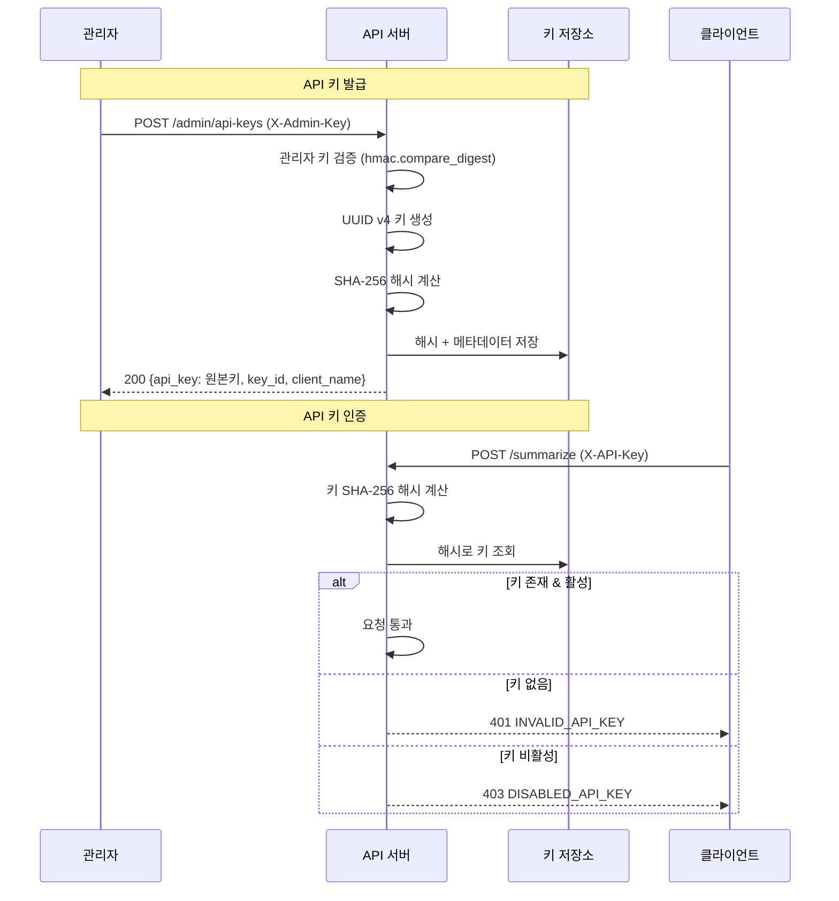

# 설계 문서: API Key 인증

## 개요

YouTube Summary API에 API 키 기반 인증 시스템을 추가한다. 이 시스템은 두 가지 인증 계층으로 구성된다:

1. **클라이언트 인증**: 발급된 API 키를 `X-API-Key` 헤더로 전달하여 보호된 엔드포인트(`POST /summarize`, `GET /tasks/{task_id}`)에 접근
2. **관리자 인증**: 환경변수 기반 마스터 키를 `X-Admin-Key` 헤더로 전달하여 API 키 발급/조회/폐기 등 관리 엔드포인트에 접근

API 키는 UUID v4 형식으로 생성되며, 키 저장소에는 SHA-256 해시값만 저장한다. 원본 키는 발급 시 한 번만 반환된다. 기존 `TaskManager`와 동일한 인메모리 저장소 패턴을 사용하며, 기존 `ErrorResponse` 형식을 그대로 활용하여 일관된 오류 응답을 제공한다.

### 주요 설계 결정

- **인메모리 저장소**: 기존 `TaskManager` 패턴과 일관성 유지. 프로덕션 전환 시 DB로 교체 가능한 인터페이스 설계
- **SHA-256 해시 저장**: API 키 원본을 저장하지 않아 저장소 유출 시에도 키 노출 방지
- **FastAPI Dependency Injection**: 미들웨어 대신 `Depends`를 활용한 인증 구현으로 엔드포인트별 세밀한 제어 가능
- **상수 시간 비교**: `hmac.compare_digest`를 사용하여 타이밍 공격 방지

## 아키텍처

### 인증 흐름

```mermaid
graph TD
    Client[클라이언트] -->|X-API-Key 헤더| AuthDep[API 키 인증 의존성]
    Admin[관리자] -->|X-Admin-Key 헤더| AdminDep[관리자 인증 의존성]
    
    AuthDep -->|유효| Protected[보호된 엔드포인트]
    AuthDep -->|무효| Reject401[401/403 응답]
    
    AdminDep -->|유효| AdminRoutes[관리 엔드포인트]
    AdminDep -->|무효| Reject403[403 응답]
    
    Protected --> Summarize[POST /summarize]
    Protected --> GetTask[GET /tasks/{task_id}]
    
    AdminRoutes --> CreateKey[POST /admin/api-keys]
    AdminRoutes --> ListKeys[GET /admin/api-keys]
    AdminRoutes --> RevokeKey[DELETE /admin/api-keys/{key_id}]
```

### API 키 발급 및 검증 흐름



## 컴포넌트 및 인터페이스

### 1. API 키 저장소 (`app/services/api_key_store.py`)

인메모리 딕셔너리를 사용하여 API 키 메타데이터를 관리한다. 기존 `TaskManager` 패턴을 따른다.

```python
class ApiKeyStore:
    def create_key(self, client_name: str) -> dict:
        """API 키를 생성하고 해시하여 저장한다. 원본 키를 포함한 메타데이터를 반환한다."""
        ...

    def validate_key(self, raw_key: str) -> Optional[dict]:
        """API 키를 해시하여 저장소에서 조회한다. 유효하면 메타데이터를, 아니면 None을 반환한다."""
        ...

    def list_keys(self) -> list[dict]:
        """모든 키의 메타데이터를 반환한다. 키 값은 마스킹 처리한다."""
        ...

    def revoke_key(self, key_id: str) -> bool:
        """키를 비활성화한다. 성공 시 True, 키가 없으면 False를 반환한다."""
        ...

    @staticmethod
    def hash_key(raw_key: str) -> str:
        """SHA-256 해시를 계산한다."""
        ...

    @staticmethod
    def mask_key(raw_key: str) -> str:
        """키의 마지막 4자리만 노출하고 나머지를 마스킹한다."""
        ...
```

### 2. 인증 의존성 (`app/api/dependencies.py`)

FastAPI의 `Depends`를 활용한 인증 함수를 제공한다.

```python
async def verify_api_key(x_api_key: str = Header(...)) -> dict:
    """X-API-Key 헤더를 검증한다. 유효하면 키 메타데이터를 반환한다."""
    ...

async def verify_admin_key(x_admin_key: str = Header(...)) -> str:
    """X-Admin-Key 헤더를 관리자 키와 비교 검증한다."""
    ...
```

### 3. 관리 라우터 (`app/api/admin_routes.py`)

API 키 관리 엔드포인트를 제공한다.

```python
# POST /admin/api-keys - API 키 발급
# GET /admin/api-keys - API 키 목록 조회
# DELETE /admin/api-keys/{key_id} - API 키 비활성화
```

### 4. 기존 라우터 수정 (`app/api/routes.py`)

기존 엔드포인트에 `verify_api_key` 의존성을 추가한다.

```python
@router.post("/summarize", ..., dependencies=[Depends(verify_api_key)])
@router.get("/tasks/{task_id}", ..., dependencies=[Depends(verify_api_key)])
```

### 5. 앱 진입점 수정 (`app/main.py`)

관리 라우터를 등록하고, `ADMIN_API_KEY` 환경변수 미설정 시 경고 로그를 기록한다.

## 데이터 모델

### 요청 모델 (`app/models/requests.py`에 추가)

```python
class CreateApiKeyRequest(BaseModel):
    """API 키 발급 요청 모델"""
    client_name: str  # 클라이언트 이름 (필수, 비어있지 않은 문자열)
```

### 응답 모델 (`app/models/responses.py`에 추가)

```python
class ApiKeyResponse(BaseModel):
    """API 키 발급 응답 모델 (원본 키 포함, 발급 시에만 반환)"""
    key_id: str           # 키 고유 ID (UUID)
    api_key: str          # 원본 API 키 (발급 시에만 노출)
    client_name: str      # 클라이언트 이름
    created_at: str       # 생성 일시 (ISO 8601)
    is_active: bool       # 활성 상태

class ApiKeyInfo(BaseModel):
    """API 키 목록 조회 시 개별 키 정보 (마스킹된 키)"""
    key_id: str           # 키 고유 ID
    masked_key: str       # 마스킹된 키 (예: "****-****-****-ab12")
    client_name: str      # 클라이언트 이름
    created_at: str       # 생성 일시
    is_active: bool       # 활성 상태

class ApiKeyListResponse(BaseModel):
    """API 키 목록 응답 모델"""
    keys: list[ApiKeyInfo]
```

### 키 저장소 내부 데이터 구조

```python
# _keys: dict[str, dict] - key_id를 키로 사용
# _hash_index: dict[str, str] - 해시값 → key_id 매핑 (빠른 조회용)
{
    "key_id": "uuid-v4",
    "key_hash": "sha256-hash",
    "key_hint": "****ab12",       # 마스킹된 키 (마지막 4자리)
    "client_name": "my-client",
    "created_at": "2024-01-01T00:00:00Z",
    "is_active": True,
}
```

### 오류 코드 매핑

| HTTP 상태 | 오류 코드 | 상황 |
|-----------|-----------|------|
| 401 | `MISSING_API_KEY` | `X-API-Key` 헤더 누락 |
| 401 | `INVALID_API_KEY` | 유효하지 않은 API 키 |
| 403 | `DISABLED_API_KEY` | 비활성화된 API 키 |
| 403 | `FORBIDDEN` | 관리자 권한 부족 |
| 404 | `KEY_NOT_FOUND` | 존재하지 않는 키 ID |
| 422 | 검증 오류 | 클라이언트 이름 누락/빈 문자열 |


## 정확성 속성 (Correctness Properties)

*속성(property)은 시스템의 모든 유효한 실행에서 참이어야 하는 특성 또는 동작이다. 속성은 사람이 읽을 수 있는 명세와 기계가 검증할 수 있는 정확성 보장 사이의 다리 역할을 한다.*

### Property 1: API 키 생성 라운드트립

*For any* 비어있지 않은 클라이언트 이름에 대해, `ApiKeyStore.create_key`를 호출하면 반환된 키는 UUID v4 형식이어야 하고, 저장소에서 해당 `key_id`로 조회한 메타데이터에는 올바른 클라이언트 이름, 생성 일시, 활성 상태(`True`)가 포함되어야 한다.

**Validates: Requirements 1.1, 1.2, 1.3**

### Property 2: API 키 해시 라운드트립

*For any* 생성된 API 키에 대해, 원본 키를 `ApiKeyStore.validate_key`에 전달하면 해당 키의 메타데이터가 반환되어야 하며, 저장소 내부에는 원본 키가 아닌 SHA-256 해시값만 저장되어 있어야 한다.

**Validates: Requirements 2.2, 7.3, 7.4**

### Property 3: 유효하지 않은 키 거부

*For any* 저장소에 등록되지 않은 임의의 문자열에 대해, `ApiKeyStore.validate_key`는 `None`을 반환해야 한다.

**Validates: Requirements 2.4**

### Property 4: 키 비활성화 후 인증 거부

*For any* 생성된 API 키에 대해, `revoke_key`로 비활성화한 후 `validate_key`를 호출하면 반환된 메타데이터의 `is_active`가 `False`여야 한다.

**Validates: Requirements 2.5, 3.4**

### Property 5: 키 목록 조회 정확성

*For any* N개의 API 키를 생성한 후 `list_keys`를 호출하면, 반환된 목록의 길이는 N이어야 하고, 각 항목에는 `key_id`, `masked_key`, `client_name`, `created_at`, `is_active` 필드가 포함되어야 한다.

**Validates: Requirements 3.1, 3.2**

### Property 6: 키 마스킹 정확성

*For any* UUID v4 형식의 API 키에 대해, `mask_key`를 적용하면 결과 문자열의 마지막 4자리는 원본 키의 마지막 4자리와 동일해야 하고, 나머지 문자는 마스킹 문자(`*`)여야 한다.

**Validates: Requirements 3.3**

### Property 7: 존재하지 않는 키 삭제 시 실패

*For any* 저장소에 등록되지 않은 임의의 UUID에 대해, `revoke_key`는 `False`를 반환해야 한다.

**Validates: Requirements 3.5**

### Property 8: 빈 클라이언트 이름 거부

*For any* 공백 문자로만 구성된 문자열(빈 문자열 포함)에 대해, API 키 발급 요청은 거부되어야 한다.

**Validates: Requirements 1.5**

### Property 9: 잘못된 관리자 키 거부

*For any* 실제 관리자 키와 다른 임의의 문자열에 대해, 관리 엔드포인트 접근 시 `FORBIDDEN` 오류가 반환되어야 한다.

**Validates: Requirements 1.4, 4.2**

### Property 10: 인증 오류 응답 형식 일관성

*For any* 인증 실패 응답에 대해, 응답 본문은 `ErrorResponse` 형식(`error.code`, `error.message`)을 따라야 한다.

**Validates: Requirements 6.1**

## 오류 처리

### HTTP 상태 코드 매핑

| 상태 코드 | 상황 | 오류 코드 |
|-----------|------|-----------|
| 401 | API 키 헤더 누락 | `MISSING_API_KEY` |
| 401 | 유효하지 않은 API 키 | `INVALID_API_KEY` |
| 403 | 비활성화된 API 키 | `DISABLED_API_KEY` |
| 403 | 관리자 권한 부족 | `FORBIDDEN` |
| 404 | 존재하지 않는 키 ID | `KEY_NOT_FOUND` |
| 422 | 클라이언트 이름 누락/빈 문자열 | Pydantic 검증 오류 |

### 오류 처리 전략

1. **인증 오류**: FastAPI `Depends`에서 `HTTPException`을 발생시켜 즉시 반환. 비즈니스 로직 실행 전에 차단
2. **관리자 인증 오류**: `hmac.compare_digest`로 상수 시간 비교 후 실패 시 403 반환
3. **입력 검증 오류**: Pydantic 모델 검증으로 빈 클라이언트 이름 등을 자동 거부
4. **키 조회 실패**: 존재하지 않는 키 ID에 대해 404 반환
5. **환경변수 미설정**: `ADMIN_API_KEY` 미설정 시 경고 로그 기록, 관리 엔드포인트에서 503 반환

### 로깅 전략

- 인증 실패 시도: `WARNING` 레벨로 기록 (마스킹된 키 포함)
- 키 발급/폐기: `INFO` 레벨로 기록
- 관리자 키 미설정: `WARNING` 레벨로 기록
- API 키 원본은 절대 로그에 기록하지 않음

## 테스트 전략

### 속성 기반 테스트 (Property-Based Testing)

- **라이브러리**: `hypothesis` (Python)
- **최소 반복 횟수**: 각 속성 테스트당 100회 이상
- **태그 형식**: `Feature: api-key-auth, Property {번호}: {속성 설명}`

각 정확성 속성은 하나의 속성 기반 테스트로 구현한다:

1. **Property 1 테스트**: 임의의 클라이언트 이름을 생성하여 키 생성 후 UUID v4 형식 및 메타데이터 검증
2. **Property 2 테스트**: 임의의 클라이언트 이름으로 키를 생성하고, 원본 키로 `validate_key` 호출 시 메타데이터 반환 및 내부 해시 저장 검증
3. **Property 3 테스트**: 임의의 문자열을 생성하여 미등록 키로 `validate_key` 호출 시 `None` 반환 검증
4. **Property 4 테스트**: 임의의 키를 생성 후 비활성화하고, `validate_key` 호출 시 `is_active=False` 검증
5. **Property 5 테스트**: 임의의 수(1~10)의 키를 생성 후 `list_keys` 호출 시 개수 및 필수 필드 검증
6. **Property 6 테스트**: 임의의 UUID v4 문자열에 대해 `mask_key` 적용 후 마지막 4자리 일치 및 나머지 마스킹 검증
7. **Property 7 테스트**: 임의의 UUID로 `revoke_key` 호출 시 `False` 반환 검증
8. **Property 8 테스트**: 공백 문자로만 구성된 임의의 문자열로 키 발급 요청 시 거부 검증
9. **Property 9 테스트**: 실제 관리자 키와 다른 임의의 문자열로 관리 엔드포인트 접근 시 `FORBIDDEN` 오류 검증
10. **Property 10 테스트**: 인증 실패 응답의 JSON 구조가 `ErrorResponse` 형식인지 검증

### 단위 테스트 (Unit Testing)

속성 기반 테스트를 보완하는 구체적 예시 및 엣지 케이스 테스트:

- **오류 코드 매핑**: 각 인증 실패 시나리오별 정확한 오류 코드 반환 검증 (6.2~6.5)
- **환경변수 미설정**: `ADMIN_API_KEY` 미설정 시 경고 로그 및 관리 엔드포인트 비활성화 검증 (4.1, 4.3)
- **공개 엔드포인트**: 헬스체크 등 공개 엔드포인트에 인증 없이 접근 가능 검증 (5.3)
- **보호된 엔드포인트 인증**: `POST /summarize`, `GET /tasks/{task_id}`에 API 키 없이 접근 시 401 반환 (5.1, 5.2)
- **통합 시나리오**: 키 발급 → 인증 → 비활성화 → 인증 거부 전체 흐름 검증

### 테스트 프레임워크

- **테스트 러너**: `pytest`
- **속성 기반 테스트**: `hypothesis`
- **HTTP 테스트**: `httpx` + FastAPI `TestClient`
- **모킹**: `unittest.mock` / `pytest-mock`
