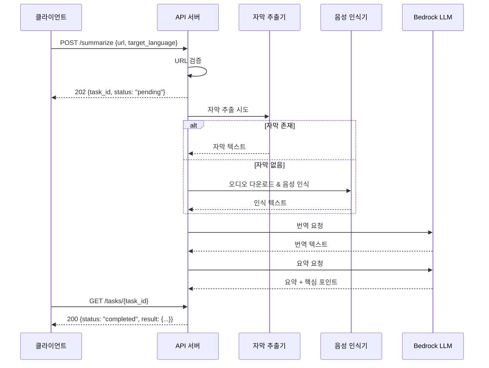

# 설계 문서: YouTube Summary API

## 개요

유튜브 영상 URL을 입력받아 자막 추출 또는 음성 인식(AWS Transcribe)으로 텍스트를 추출하고, AWS Bedrock LLM을 활용하여 번역, 요약, 정리하는 FastAPI REST API를 설계한다.

시스템은 비동기 작업 처리 패턴을 채택하여, 요청 접수 시 작업 ID를 즉시 반환하고 백그라운드에서 파이프라인(텍스트 추출 → 번역 → 요약)을 실행한다. 클라이언트는 작업 ID로 진행 상태를 폴링하여 결과를 조회한다.

### 주요 기술 스택

- **프레임워크**: FastAPI (Python 3.11+)
- **자막 추출**: `youtube-transcript-api` 라이브러리
- **오디오 다운로드**: `yt-dlp` 라이브러리
- **음성 인식**: AWS Transcribe
- **번역/요약**: AWS Bedrock (Claude 모델)
- **비동기 처리**: FastAPI BackgroundTasks
- **AWS SDK**: boto3

## 아키텍처

### 시스템 구조

```mermaid
graph TD
    Client[클라이언트] -->|POST /summarize| API[FastAPI 서버]
    API -->|작업 ID 반환| Client
    Client -->|GET /tasks/{id}| API
    
    API -->|백그라운드 처리| Pipeline[처리 파이프라인]
    Pipeline --> SubExtractor[자막 추출기]
    Pipeline --> AudioExtractor[음성 인식기]
    SubExtractor -->|자막 텍스트| Translator[번역 엔진]
    AudioExtractor -->|인식 텍스트| Translator
    Translator -->|번역 텍스트| Summarizer[요약 엔진]
    
    AudioExtractor -->|오디오 업로드| S3[AWS S3]
    S3 -->|오디오 파일| Transcribe[AWS Transcribe]
    Translator -->|번역 요청| Bedrock[AWS Bedrock]
    Summarizer -->|요약 요청| Bedrock
```

### 처리 흐름



## 컴포넌트 및 인터페이스

### 1. API 라우터 (`app/api/routes.py`)

FastAPI 라우터로 두 개의 엔드포인트를 제공한다.

```python
# POST /summarize - 요약 작업 요청
# GET /tasks/{task_id} - 작업 상태 조회
```

- `POST /summarize`: 유튜브 URL과 대상 언어를 받아 작업을 생성하고 작업 ID를 반환
- `GET /tasks/{task_id}`: 작업 ID로 현재 처리 상태 및 결과를 조회

### 2. URL 검증기 (`app/services/url_validator.py`)

유튜브 URL의 유효성을 검증하고 비디오 ID를 추출한다.

```python
def validate_youtube_url(url: str) -> str:
    """유튜브 URL을 검증하고 비디오 ID를 반환한다."""
    ...
```

- `youtube.com/watch?v=` 및 `youtu.be/` 형식 지원
- 정규식 기반 URL 패턴 매칭
- 유효하지 않은 URL에 대해 `ValueError` 발생

### 3. 자막 추출기 (`app/services/subtitle_extractor.py`)

`youtube-transcript-api`를 사용하여 자막 데이터를 추출한다.

```python
async def extract_subtitles(video_id: str) -> Optional[str]:
    """자막을 추출한다. 자막이 없으면 None을 반환한다."""
    ...
```

- 자막 존재 여부 확인
- 여러 언어 자막 중 원본 언어 우선 선택
- 자막 추출 실패 시 None 반환 (음성 인식기로 폴백)

### 4. 음성 인식기 (`app/services/audio_transcriber.py`)

`yt-dlp`로 오디오를 다운로드하고 AWS Transcribe로 텍스트를 변환한다.

```python
async def transcribe_audio(video_id: str) -> str:
    """오디오를 다운로드하고 음성 인식으로 텍스트를 추출한다."""
    ...
```

- `yt-dlp`로 오디오 파일 다운로드
- S3에 오디오 업로드 후 Transcribe 작업 시작
- 작업 완료 대기 후 텍스트 반환
- 임시 파일 정리

### 5. 요약 엔진 (`app/services/summary_engine.py`)

AWS Bedrock LLM을 활용하여 번역과 요약을 수행한다.

```python
async def translate_text(text: str, target_language: str = "ko") -> str:
    """텍스트를 대상 언어로 번역한다."""
    ...

async def summarize_text(text: str) -> SummaryResult:
    """텍스트를 요약하고 핵심 포인트를 추출한다."""
    ...
```

- Bedrock `invoke_model` API 호출
- 번역: 원본 텍스트 → 대상 언어 텍스트
- 요약: 전체 요약문 + 핵심 포인트 목록 생성

### 6. 작업 관리자 (`app/services/task_manager.py`)

인메모리 작업 상태를 관리한다.

```python
class TaskManager:
    def create_task(self, url: str, target_language: str) -> str: ...
    def get_task(self, task_id: str) -> Optional[TaskInfo]: ...
    def update_status(self, task_id: str, status: TaskStatus, result=None, error=None): ...
```

- 작업 생성, 조회, 상태 업데이트
- 상태: `pending`, `extracting`, `translating`, `summarizing`, `completed`, `failed`

### 7. 처리 파이프라인 (`app/services/pipeline.py`)

전체 처리 흐름을 오케스트레이션한다.

```python
async def process_summary(task_id: str, video_id: str, target_language: str) -> None:
    """백그라운드에서 전체 요약 파이프라인을 실행한다."""
    ...
```

- 자막 추출 → (실패 시) 음성 인식 → 번역 → 요약
- 각 단계별 상태 업데이트
- 오류 발생 시 작업 상태를 `failed`로 변경

## 데이터 모델

### 요청 모델

```python
class SummarizeRequest(BaseModel):
    url: str                          # 유튜브 URL (필수)
    target_language: str = "ko"       # 대상 언어 (기본값: 한국어)
```

### 응답 모델

```python
class TaskResponse(BaseModel):
    task_id: str                      # 작업 ID (UUID)
    status: TaskStatus                # 현재 상태

class SummaryResult(BaseModel):
    video_title: str                  # 영상 제목
    original_language: str            # 원본 언어
    extraction_method: str            # 추출 방식 ("subtitle" | "transcribe")
    translated_text: str              # 번역된 텍스트
    summary: str                      # 요약문
    key_points: list[str]             # 핵심 포인트 목록

class TaskDetailResponse(BaseModel):
    task_id: str                      # 작업 ID
    status: TaskStatus                # 현재 상태
    result: Optional[SummaryResult]   # 완료 시 결과
    error: Optional[ErrorDetail]      # 실패 시 오류 정보
```

### 오류 응답 모델

```python
class ErrorDetail(BaseModel):
    code: str                         # 오류 코드
    message: str                      # 오류 메시지

class ErrorResponse(BaseModel):
    error: ErrorDetail
```

### 작업 상태 열거형

```python
class TaskStatus(str, Enum):
    PENDING = "pending"               # 대기중
    EXTRACTING = "extracting"         # 텍스트 추출중
    TRANSLATING = "translating"       # 번역중
    SUMMARIZING = "summarizing"       # 요약중
    COMPLETED = "completed"           # 완료
    FAILED = "failed"                 # 실패
```

### 프로젝트 구조

```
app/
├── main.py                          # FastAPI 앱 진입점
├── api/
│   └── routes.py                    # API 엔드포인트 정의
├── models/
│   ├── requests.py                  # 요청 모델
│   └── responses.py                 # 응답 모델
├── services/
│   ├── url_validator.py             # URL 검증
│   ├── subtitle_extractor.py        # 자막 추출
│   ├── audio_transcriber.py         # 음성 인식
│   ├── summary_engine.py            # 번역/요약 엔진
│   ├── task_manager.py              # 작업 관리
│   └── pipeline.py                  # 처리 파이프라인
└── tests/
    ├── test_url_validator.py
    ├── test_subtitle_extractor.py
    ├── test_summary_engine.py
    ├── test_pipeline.py
    └── test_api.py
```

## 정확성 속성 (Correctness Properties)

*속성(property)은 시스템의 모든 유효한 실행에서 참이어야 하는 특성 또는 동작이다. 속성은 사람이 읽을 수 있는 명세와 기계가 검증할 수 있는 정확성 보장 사이의 다리 역할을 한다.*

### Property 1: 유효한 유튜브 URL에서 비디오 ID 추출

*For any* 11자리 영숫자 비디오 ID에 대해, `youtube.com/watch?v={id}` 형식과 `youtu.be/{id}` 형식 모두에서 `validate_youtube_url`을 호출하면 동일한 비디오 ID가 반환되어야 한다.

**Validates: Requirements 1.1, 1.4**

### Property 2: 유효하지 않은 URL 거부

*For any* 유튜브 URL 패턴(`youtube.com/watch?v=` 또는 `youtu.be/`)에 매칭되지 않는 임의의 문자열에 대해, `validate_youtube_url`은 `ValueError`를 발생시켜야 한다.

**Validates: Requirements 1.2**

### Property 3: 원본 언어 자막 우선 선택

*For any* 자막 언어 목록과 원본 언어가 주어졌을 때, 원본 언어가 목록에 포함되어 있으면 자막 선택 함수는 항상 원본 언어 자막을 반환해야 한다.

**Validates: Requirements 2.3**

### Property 4: 성공 응답 필수 필드 포함

*For any* 유효한 `SummaryResult` 객체에 대해, 직렬화된 JSON 응답에는 영상 제목(`video_title`), 원본 언어(`original_language`), 추출 방식(`extraction_method`), 번역된 텍스트(`translated_text`), 요약문(`summary`), 핵심 포인트(`key_points`) 필드가 모두 포함되어야 한다.

**Validates: Requirements 5.2, 5.3, 6.1, 6.2, 6.4**

### Property 5: 오류 응답 필수 필드 포함

*For any* 오류 응답에 대해, 직렬화된 JSON에는 오류 코드(`code`)와 오류 메시지(`message`) 필드가 모두 포함되어야 한다.

**Validates: Requirements 6.3**

### Property 6: 작업 상태 조회 정확성

*For any* 작업 ID와 설정된 상태에 대해, `TaskManager`에 상태를 업데이트한 후 해당 작업 ID로 조회하면 업데이트된 상태가 정확히 반환되어야 하며, 상태가 `completed`인 경우 결과(`result`)가 포함되어야 한다.

**Validates: Requirements 7.2, 7.3**

### Property 7: 존재하지 않는 작업 ID 조회 시 None 반환

*For any* `TaskManager`에 등록되지 않은 임의의 UUID에 대해, `get_task`는 `None`을 반환해야 한다.

**Validates: Requirements 7.4**

## 오류 처리

### HTTP 상태 코드 매핑

| 상태 코드 | 상황 | 오류 코드 |
|-----------|------|-----------|
| 422 | URL 형식 오류, 필수 필드 누락 | `INVALID_URL`, `MISSING_FIELD` |
| 404 | 영상 없음, 작업 ID 없음 | `VIDEO_NOT_FOUND`, `TASK_NOT_FOUND` |
| 500 | 예상치 못한 내부 오류 | `INTERNAL_ERROR` |
| 502 | 외부 서비스 호출 실패 (Transcribe, Bedrock) | `AUDIO_DOWNLOAD_FAILED`, `TRANSCRIBE_FAILED`, `TRANSLATION_FAILED`, `SUMMARY_FAILED` |
| 504 | AWS 서비스 타임아웃 | `SERVICE_TIMEOUT` |

### 오류 처리 전략

1. **URL 검증 오류**: Pydantic 검증 + 커스텀 검증기에서 즉시 반환
2. **외부 서비스 오류**: try-except로 캡처 후 작업 상태를 `failed`로 변경, 오류 상세 정보 저장
3. **타임아웃**: boto3 클라이언트에 타임아웃 설정, `ReadTimeoutError`/`ConnectTimeoutError` 캡처
4. **예상치 못한 오류**: 글로벌 예외 핸들러에서 500 반환, 스택 트레이스 로깅
5. **자막 추출 실패**: 오류 로깅 후 음성 인식기로 자동 폴백

### 로깅 전략

- 구조화된 JSON 로깅 (Python `logging` + `structlog` 또는 JSON formatter)
- 요청/응답 로깅 미들웨어
- 오류 발생 시 스택 트레이스 포함
- 로그 레벨: DEBUG(개발), INFO(요청/응답), WARNING(폴백), ERROR(서비스 오류)

## 테스트 전략

### 속성 기반 테스트 (Property-Based Testing)

- **라이브러리**: `hypothesis` (Python)
- **최소 반복 횟수**: 각 속성 테스트당 100회 이상
- **태그 형식**: `Feature: youtube-summary-api, Property {번호}: {속성 설명}`

각 정확성 속성은 하나의 속성 기반 테스트로 구현한다:

1. **Property 1 테스트**: 임의의 11자리 영숫자 문자열을 생성하여 두 URL 형식에서 동일한 ID가 추출되는지 검증
2. **Property 2 테스트**: 유튜브 URL 패턴에 매칭되지 않는 임의의 문자열을 생성하여 `ValueError` 발생 검증
3. **Property 3 테스트**: 임의의 언어 코드 목록과 원본 언어를 생성하여 원본 언어 우선 선택 검증
4. **Property 4 테스트**: 임의의 `SummaryResult` 객체를 생성하여 JSON 직렬화 시 필수 필드 포함 검증
5. **Property 5 테스트**: 임의의 `ErrorDetail` 객체를 생성하여 JSON 직렬화 시 필수 필드 포함 검증
6. **Property 6 테스트**: 임의의 작업 상태와 결과를 생성하여 `TaskManager` 상태 조회 정확성 검증
7. **Property 7 테스트**: 임의의 UUID를 생성하여 미등록 작업 ID 조회 시 None 반환 검증

### 단위 테스트 (Unit Testing)

속성 기반 테스트를 보완하는 구체적 예시 및 엣지 케이스 테스트:

- **URL 검증**: 빈 문자열, 공백 문자열, 다른 사이트 URL 등 엣지 케이스
- **자막 추출**: 자막 존재/부재 시나리오, 추출 오류 시 폴백 동작
- **음성 인식**: 오디오 다운로드 실패, Transcribe 실패 시나리오
- **번역/요약**: Bedrock 호출 성공/실패 시나리오
- **파이프라인**: 전체 흐름 통합 테스트 (모킹 활용)
- **API 엔드포인트**: FastAPI TestClient를 사용한 HTTP 요청/응답 테스트
- **오류 처리**: 각 HTTP 상태 코드별 오류 응답 검증
- **타임아웃**: AWS 서비스 타임아웃 시 504 반환 검증

### 테스트 프레임워크

- **테스트 러너**: `pytest`
- **속성 기반 테스트**: `hypothesis`
- **HTTP 테스트**: `httpx` + FastAPI `TestClient`
- **모킹**: `unittest.mock` / `pytest-mock`
- **AWS 모킹**: `moto` (S3, Transcribe 모킹)
